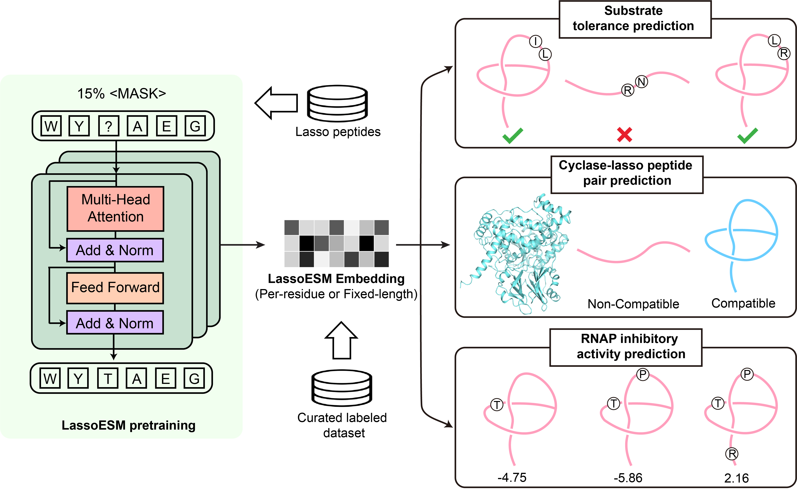

# LassoESM: A tailored language model to enhance lasso peptide property prediction

 

## Repository Structure
- LassoESM
  - `LassoESM_pretraining.py`: Pretraining Lasso Peptide-Specific Language Model
  - `get_embeddings_LassoESM`: extract embeddings for peptide variants in training set from LassoESM/PeptideESM/VanillaESM, then feed them into various downstream classification models
    
- Downstream task 1: substrate_tolerance_prediction  
  - `hyperparameter_optimization_ML_FusA.py`: grid-search for hyperparameters of downstream classification models
  - `downstream_models_performance_diff_3embs.py`: compare downstream model performance with different embeddings (VanillaESM, PeptideESM, LassoESM)
  - `diff_training_size.py`: evaulate downstream model performance using different training size
  - `cal_uncertainty.py`: explore uncertainty of classification model output

- Downstream task 2: cycalse_peptide_pair_prediction
  - `generate_negative_cyclase_peptide_pairs.py`: generate the synthetic cyclase-peptide pairs (negative samples)
  - `predict_cyclase_peptide_pairs`: a general model (MLP) to predict cyclase(embedded by VanillaESM)-peptide(embedded by LassoESM) pairs
  - `predict_cyclase_peptide_pairs_with_CrossAttention`: add a cross-attention layer, where lasso peptide embeddings reweight its corresponding cyclase embeddings
  - `predict_non_natural_cyclase_peptide_pairs.py`: use the trained cyclase-peptide pair prediction model to assess the compatibility of FusC with other predicted naturally occuring lasso peptides

- Downstream task 3: antimicrobial_activity_prediction
  - `get_embeddings_for_Ubonodin.py`: extracting embeddings for Ubonodin variant sequences from LassoESM/PeptideESM/VanillaESM models
  - `antimicrobial_activity_prediction_for_Ubonodin.py`: predict the antimicrobial activity of Ubonodin variant sequences
  - `get_embeddings_for_Klebsidin.py`: extracting embeddings for Klebsidin variant sequences from LassoESM/PeptideESM/VanillaESM models
  - `antimicrobial_activity_prediction_for_Klebsidin.py`: predict the antimicrobial activity of Klebsidin variant sequences

## Dependency
To set up the environment for this project, use the provided `environment.yml` file. This file contains all necessary dependencies.

## Authors

- **Xuenan Mi** - [xmi4@illinois.edu](mailto:xmi4@illinois.edu)

