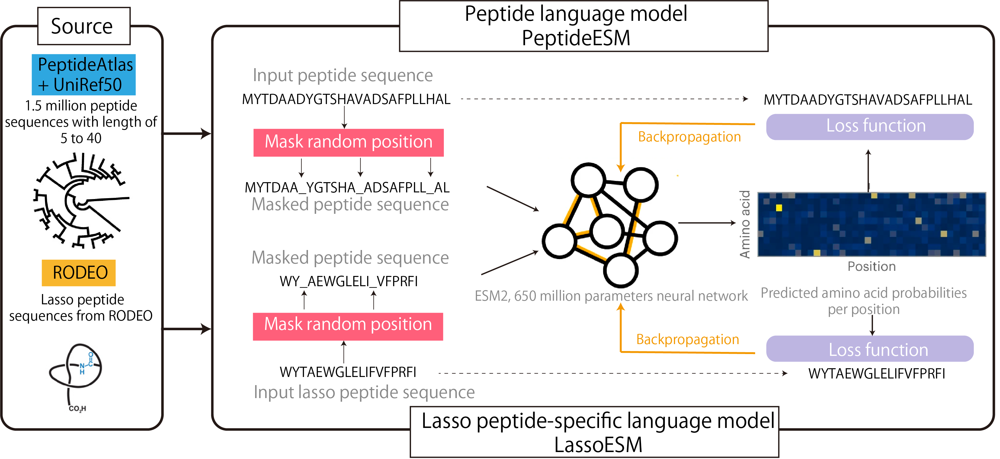

# LassoESM: A tailored language model to enhance lasso peptide property prediction

This repository contains all the source code for predicting substrate selectivity of lasso cyclase using protein language model.

## Repository Structure
- Pretraining Lasso Peptide-Specific Language Model (LassoESM)
  - `LassoESM_pretraining.py`
    
- Evaluation of LassoESM for Substrate Prediction
  - `get_embeddings_LassoESM`: extract embeddings for peptide variants in training set from LassoESM, then feed them into various downstream classification models
  - `hyperparameter_optimization_ML_FusA.py`: grid-search for hyperparameters of downstream classification models
  - `downstream_models_performance_diff_3embs.py`: compare downstream model performance with different embeddings (VanillaESM, PeptideESM, LassoESM)
  - `diff_training_size.py`: evaulate downstream model performance using different training size
  - `cal_uncertainty.py`: explore uncertainty of classification model output
    
- Model Verification and Optimization
  - `tSNE-plot.py`: visualize the training data and new experimental verified data sets

- Antimicrobial activity prediction
  - `antimicrobial_activity_prediction.py`: predict the antimicrobial activity of lasso peptide using LassoESM embeddings

- A general model for predicting lasso peptide and lasso cyclase pairs
  - `predict_cyclase_peptide_pairs`: a general model (MLP) to predict cyclase(embedded by VanillaESM)-peptide(embedded by LassoESM) pairs
  - `predict_cyclase_peptide_pairs_with_CrossAttention`: add a crUbonodin_antimicrobial_activity_predictionoss-attention layer, where lasso peptide embeddings reweight its corresponding cyclase embeddings

## Dependency
To set up the environment for this project, use the provided `environment.yml` file. This file contains all necessary dependencies.

## Authors

- **Xuenan Mi** - [xmi4@illinois.edu](mailto:xmi4@illinois.edu)

